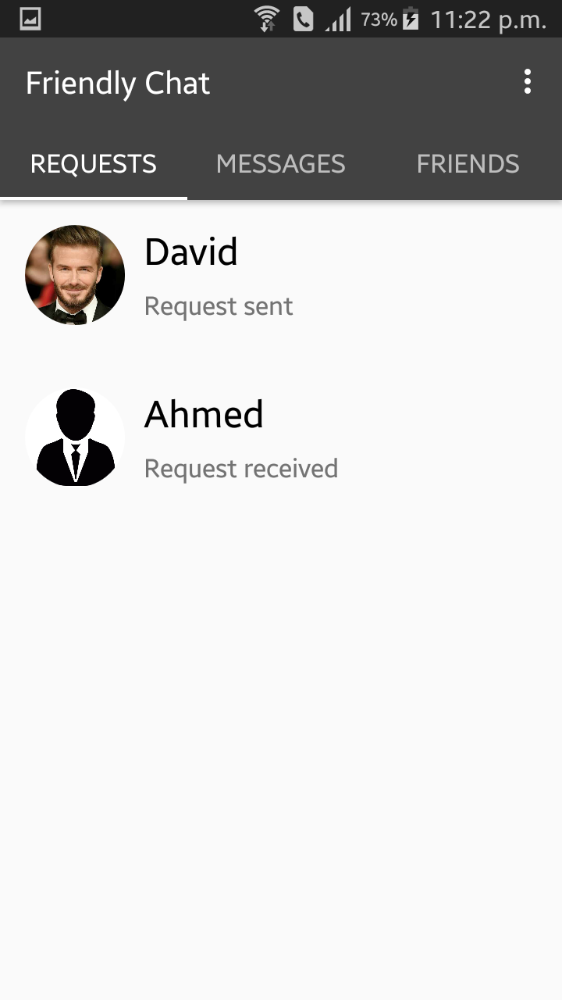

# FriendlyChat
FriendlyChat is a chat application, where user can add different person as a friend and start chatting with them to get to know them. But first of all they need to open an account first by providing a user name, an email address and a strong password which has to be at least 6 characters long. Then they can log in using that email and password. They will be able to see all the users in a single list. From there they can check out their profile and if they want they can send them friend request. After accepting friend request that person will be added to the friend list and they can start a conversation. They can unfriend a friend whenever they want.

## Start Page
In this page user will be asked to create an account or if he/she has already an account, then he/she can just log in to their account.

### Registration Page
Here user have to provide a user name, an email address and a strong password which has to be at least 6 characters long.

### Login Page
If any user have already created an account then he/she can simply log in by providing his/her email address and password.

## Home Page
There will be three activity in the home page. User can change their page by swiping left and right. 

### Requests
This page will have all the friend requests list a user gets from other persons and a user sends to other persons. 

### Messages
All the chat list will be shown in this page.

### Friends
All the friends will be shown here in a list.

If user click on a friend's name, it will give two options. Either user can send him/her a message or user can check hime/her profile.

If user select chat option, then he/she will be taken directly to the chat box.

## Menu
In the menu user will have three options. They can visit their profile, they can see all users list or they can log out.

### Account Setting
User can change their profile picture by cropping a picture and change status in account setting.

This is how a user can crop an image.

This is how a user can change status.

### All User List
Here user can see every person's name who are using this application. From here user can check out their profile as well as if they want they can send them a friend request.

From this all user list, one person can select a user, checkout his/her profile and then if he/she wants can send him/her a request. They will be able to cancel the request as well.

 

If users want to checkout other person's profile, it will look like this.

